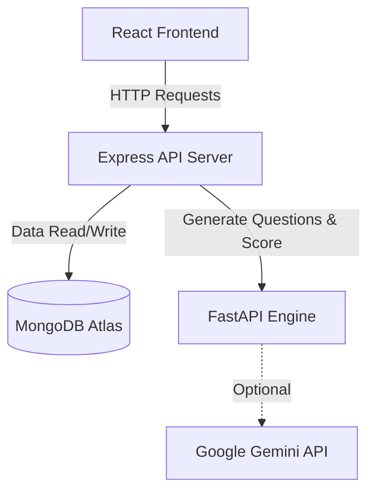

<p align="center">
  
  
  
  
</p>

# RECALL: AI-Powered Knowledge Tracing Engine

> **Intelligent platform that hacks the human forgetting curve.**

RECALL is a full-stack, AI-driven memory retention platform that uses the **Ebbinghaus Forgetting Curve** and **Half-Life Regression (HLR)** to scientifically model, track, and optimize knowledge retention. Unlike traditional flashcard apps that rely on static Spaced Repetition Systems (SRS), RECALL implements a **continuous exponential decay model** with real-time behavioral scoring — providing a mathematically precise view of how your memory evolves over time.

---

## 🧠 Mathematical Foundation

RECALL's core engine is built on the Ebbinghaus memory retention formula:

$$R(t) = M \times 2^{-t/h}$$

| Symbol | Meaning | Range |
|--------|---------|-------|
| $R(t)$ | Memory retention at time $t$ | 0–100% |
| $M$ | Initial memory strength (post-assessment) | 100% |
| $t$ | Time elapsed since last review (hours) | ≥ 0 |
| $h$ | Half-life — hours until retention halves | 1–8,760 hrs |

The half-life $h$ is dynamically updated after each assessment using a **behavioral score** that factors:

| Signal | Weight | Purpose |
|--------|--------|---------|
| Correctness | 60% | Core knowledge accuracy |
| Response Latency | 20% | Processing speed = encoding depth |
| Self-Reported Confidence | 20% | Metacognitive calibration |

This architecture **strictly avoids** SM-2, Leitner, or any interval-based SRS algorithm — retention is computed as a continuous function, not discrete scheduled reviews.

---

## 🏗️ Architecture Overview

```
┌─────────────────┐     ┌─────────────────┐     ┌─────────────────────┐
│   React Client  │────▶│  Express Server  │────▶│  FastAPI AI Engine   │
│   (Vite, 5173)  │◀────│  (Node.js, 5000) │◀────│  (Python, 8001)     │
└─────────────────┘     └────────┬─────────┘     │  • Gemini 2.0 Flash │
                                 │               │  • HLR Computation   │
                                 ▼               └─────────────────────┘
                        ┌─────────────────┐
                        │  MongoDB Atlas   │
                        │  (Replica Set)   │
                        └─────────────────┘
```

| Layer | Technology | Responsibility |
|-------|-----------|----------------|
| **Frontend** | React 18, Vite, Recharts, Lucide, TailwindCSS | SPA with real-time decay visualization |
| **Backend** | Node.js, Express (ES Modules) | REST API, JWT auth, business logic |
| **AI Engine** | FastAPI, Google Gemini 2.0 Flash | Question generation, HLR math |
| **Database** | MongoDB Atlas (Replica Set) | Users, Skills, Topics, MemoryStates, Assessments |

> See [ARCHITECTURE.md](./ARCHITECTURE.md) for detailed system design.

---

## ✨ Key Features

### 🔐 Authentication & Security
- JWT Bearer token authentication with bcrypt password hashing
- Protected routes with automatic session invalidation on token expiry
- Passwords excluded from all query responses (`select: false`)

### 📂 Skill → Topic Hierarchy
- Organize knowledge into **Skills** (e.g., "React") and **Topics** (e.g., "Hooks", "Context API")
- Cascade delete: removing a skill purges all associated topics, memory states, and assessments
- Duplicate prevention with case-insensitive compound indexes

### 🤖 AI Assessment Engine (Gemini 2.0 Flash)
- **Entry Test (3 MCQs)**: Calibrates initial half-life when adding a new topic
- **Review Quiz (5 MCQs)**: Dynamic questions spanning recall, understanding, application, analysis, and evaluation
- **Flashcard Generation**: 10 front/back pairs for passive review
- Strict Pydantic validation: 4 options per question, correct answer must match option verbatim
- Automatic fallback to mock questions if Gemini API is unavailable

### 📊 Behavioral Scoring
- **Composite behavioral score** (0–5) replaces naive correct/incorrect grading
- Factors: correctness (60%), response latency (20%), confidence (20%)
- Behavioral score drives HLR multiplier (0.3× to 2.5×) for half-life updates

### 📈 Dynamic Dashboard
- **Per-Topic Dashboard**: Ebbinghaus forgetting curve (past 24h + future 72h), Memory Strength (M), Half-Life (h), Review Countdown, Assessment History
- **Professional Readiness Score**: Cross-topic aggregate with tiered badges (Expo Ready / Strong / Moderate / Needs Work)
- **Skill Mastery View**: Average retention across all topics in a skill with 7-day projection
- **Interview Readiness Tracker**: Percentage of topics above 80% retention threshold

### 🚨 Alert System
- **RECALL NOW**: Full-screen emergency alert when topic retention drops below 50%
- **Priority Review**: Homepage banner listing all critical topics sorted by severity
- **Zone-Based Color Coding**: Green (>70%), Yellow (50–70%), Red (<50%) — applied to all metrics, charts, and cards
- **System Status**: Live API + AI Engine health indicators (polls every 30s)

---

## 🚀 Quick Start

### Prerequisites
- **Node.js** ≥ 18
- **Python** ≥ 3.10
- **MongoDB Atlas** cluster (or local MongoDB)
- **Google Gemini API key** (optional — falls back to mock questions)

### 1. Clone the Repository
```bash
git clone https://github.com/your-username/recall.git
cd recall
```

### 2. Start the Backend (Express)
```bash
cd server
npm install
# Create .env file:
#   PORT=5000
#   MONGO_URI=mongodb://...
#   JWT_SECRET=your_secret_key
#   AI_ENGINE_URL=http://localhost:8001
npm run dev
```

### 3. Start the AI Engine (FastAPI)
```bash
cd ai-engine
pip install -r requirements.txt
# Create .env file:
#   GEMINI_API_KEY=your_gemini_key
uvicorn main:app --port 8001
```

### 4. Start the Frontend (Vite)
```bash
cd client
npm install
npm run dev
```

### 5. Open the Application
Navigate to **http://localhost:5173** — Register, create skills, add topics, and start tracking your memory retention.

---

## 📁 Project Structure

```
recall/
├── client/                         # React Frontend (Vite)
│   └── src/
│       ├── pages/
│       │   ├── LoginPage.jsx       # Authentication
│       │   ├── RegisterPage.jsx    # User registration
│       │   ├── HomePage.jsx        # Skill grid + Priority Review
│       │   ├── SkillDetailPage.jsx # Topics + Mastery + Entry Test
│       │   ├── DashboardPage.jsx   # Per-topic Ebbinghaus dashboard
│       │   ├── QuizPage.jsx        # AI MCQ assessment
│       │   └── TopicAnalyticsPage.jsx # 7-day projection
│       ├── components/
│       │   ├── RetentionGraph.jsx  # Recharts area chart
│       │   └── SystemStatus.jsx    # API/AI health indicators
│       ├── context/AuthContext.jsx # JWT auth state management
│       └── services/api.js        # Axios API client
│
├── server/                         # Node.js Backend (Express)
│   └── src/
│       ├── models/
│       │   ├── User.js             # Auth model (bcrypt)
│       │   ├── Skill.js            # Skill hierarchy
│       │   ├── Topic.js            # Learning topics
│       │   ├── MemoryState.js      # HLR state (M, h, lastCalc)
│       │   └── Assessment.js       # Quiz results + behavioral data
│       ├── controllers/
│       │   ├── skillController.js  # CRUD + cascade delete
│       │   ├── topicController.js  # CRUD + memoryState enrichment
│       │   ├── quizController.js   # AI proxy + behavioral scoring
│       │   └── dashboardController.js # Retention + projection
│       ├── routes/                 # Express route definitions
│       ├── middleware/
│       │   └── authMiddleware.js   # JWT verification
│       ├── app.js                  # Express configuration
│       └── server.js               # MongoDB connection + startup
│
├── ai-engine/                      # Python AI Microservice (FastAPI)
│   ├── main.py                     # Gemini integration + HLR endpoints
│   └── requirements.txt           # Python dependencies
│
├── README.md                       # This file
├── ARCHITECTURE.md                 # Detailed system architecture
├── REQUIREMENTS_TRACEABILITY.md     # Functional & non-functional requirements
└── REQUIREMENTS_CHECKLIST.md       # Granular feature checklist
```

---

## 🔧 Environment Variables

### Server (`server/.env`)
| Variable | Required | Description |
|----------|----------|-------------|
| `PORT` | Yes | Server port (default: 5000) |
| `MONGO_URI` | Yes | MongoDB Atlas connection string |
| `JWT_SECRET` | Yes | Secret key for JWT signing |
| `AI_ENGINE_URL` | Yes | FastAPI service URL (default: `http://localhost:8001`) |

### AI Engine (`ai-engine/.env`)
| Variable | Required | Description |
|----------|----------|-------------|
| `GEMINI_API_KEY` | No* | Google Gemini API key (*fallback to mock questions if absent) |

---

## 🛡️ Security Protocols

| Protocol | Implementation |
|----------|---------------|
| **Password Hashing** | bcrypt with 10 salt rounds |
| **Token Auth** | JWT Bearer tokens (stateless) |
| **Env Isolation** | All secrets in `.env`, excluded from version control via `.gitignore` |
| **Input Validation** | Pydantic models (AI Engine), Express validators (Backend) |
| **CORS** | Restricted to `localhost:5173` and `127.0.0.1:5173` |
| **Query Injection Prevention** | Mongoose ODM parameterized queries |

---

## ⚡ Performance Targets

| Metric | Target | Implementation |
|--------|--------|----------------|
| AI Question Generation | < 5 seconds | Gemini 2.0 Flash with 30s timeout; fallback to instant mock questions |
| Page Load Time | < 2 seconds | Vite HMR, code splitting, lazy-loaded routes |
| Retention Calculation | < 50ms | Local JS math fallback when AI Engine is unreachable |
| Dashboard Render | < 1 second | Client-side Ebbinghaus computation + Recharts animation |
| Health Check Polling | Every 30s | SystemStatus component with non-blocking requests |

---

## 🗺️ Phase 2 / Roadmap

> Features planned for the next development cycle to enhance the platform:

| Feature | Priority | Description |
|---------|----------|-------------|
| 🔴 **Panic Button** | High | One-click "Review All Critical Topics" action that queues all sub-50% topics into a sequential quiz marathon |
| 📧 **Daily Email Digests** | High | Automated email notifications summarizing decaying topics and recommended review schedule |
| 📱 **Mobile PWA** | High | Progressive Web App with push notifications for review reminders |
| 🧪 **A/B Testing Engine** | Medium | Compare HLR multiplier strategies and question difficulty calibration |
| 📊 **Learning Analytics Export** | Medium | CSV/PDF export of retention history, quiz performance trends, and mastery reports |
| 🔗 **OAuth Integration** | Medium | Google/GitHub SSO for frictionless onboarding |
| 🎯 **Adaptive Difficulty** | Medium | AI adjusts question difficulty based on historical performance patterns |
| 🌐 **Multi-Language Support** | Low | i18n for UI and AI-generated content in multiple languages |
| 🤝 **Team/Classroom Mode** | Low | Shared skill trees with aggregated class-level retention dashboards |

---

## 📄 License

This project is developed for academic and demonstration purposes.

---

<p align="center">
  <strong>RECALL</strong> — Because forgetting is a bug, not a feature. 🧠
</p>

---

## 📐 Architecture Flow Diagram


